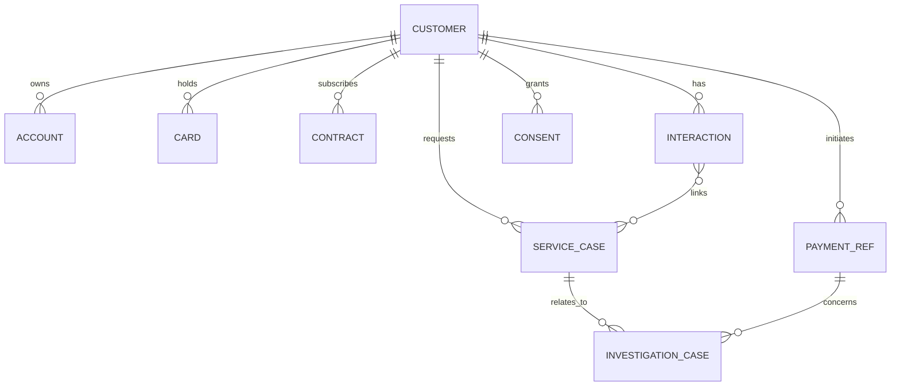

# I1 — Modèle CRM / Customer 360

## But

Définir la **vue logique Customer 360** nécessaire au scénario Customer Service sans faire de Pega le système de record de toutes les données client.

## Principe

Customer 360 est une **vue agrégée**. Chaque donnée conserve un propriétaire explicite. Pega peut conserver des références, snapshots de travail et données nécessaires au traitement du Case, mais l'autorité reste dans les systèmes de record désignés.

## Modèle logique

## Entités

### Customer

- `customerIdSynthetic`
- `displayNameSynthetic`
- `customerSegment`
- `preferredLanguage`
- `contactPreferences`
- `riskFlagsReadOnly[]`
- `authenticationLevel`
- `lastRefreshAt`

Les informations d'identité publiées dans le dépôt sont exclusivement synthétiques.

### AccountReference

- `accountIdSynthetic`
- `maskedIban`
- `accountType`
- `currency`
- `status`
- `balanceSnapshot` — optionnel, lecture seule, avec timestamp

### CardReference

- `cardIdSynthetic`
- `maskedPan`
- `cardType`
- `status`

### ContractReference

- `contractIdSynthetic`
- `productCode`
- `status`
- `effectiveDate`

### PaymentReference

- `paymentId`
- `paymentScheme` : `SCT_INST`, `WERO_SIMULATED`, autre valeur synthétique
- `amount`
- `currency`
- `createdAt`
- `status`
- `beneficiaryMasked`
- `correlationId`
- `sourceSystem`

### CustomerInteraction

- `interactionId`
- `customerIdSynthetic`
- `channel`
- `agentIdSynthetic`
- `startedAt`
- `endedAt`
- `reasonCode`
- `summary`
- `linkedCaseIds[]`
- `consentContext`

### ServiceCase

- `caseId`
- `caseType`
- `customerIdSynthetic`
- `interactionId`
- `priority`
- `status`
- `slaTargetAt`
- `owner`
- `workQueue`
- `relatedInvestigationIds[]`

### InvestigationCase

- `caseId`
- `investigationType`
- `paymentId`
- `correlationId`
- `status`
- `severity`
- `evidence[]`
- `decisionRefs[]`
- `approvalRefs[]`
- `resolutionCode`

### Consent

- `consentId`
- `purpose`
- `status`
- `validFrom`
- `validUntil`
- `source`

## Vue agent

Ordre recommandé de présentation :

1. identité synthétique et niveau d'authentification ;
2. alertes utiles à l'interaction ;
3. dossiers ouverts ;
4. interactions récentes ;
5. paiements récents ;
6. comptes/contrats pertinents ;
7. actions autorisées selon rôle.

Le POC évite de construire un « écran sapin de Noël » chargeant tout le SI. Les sections lourdes doivent être chargées à la demande ou selon besoin métier.

## Stratégie d'accès aux données

| Donnée | Mode préféré | Cache/snapshot Pega | Justification |
|---|---|---|---|
| Identité client | API synchrone / source CRM-MDM simulée | Snapshot court possible | fraîcheur et contrôle d'accès |
| Comptes/contrats | API à la demande | Références seulement par défaut | éviter duplication inutile |
| Paiements | API + événements | Snapshot du paiement lié au Case | preuve d'investigation et résilience |
| Interactions | Pega/CRM de service | Oui selon rétention | cœur du Customer Service |
| Cases | Pega | Oui | Pega est système de record du Case |
| Décisions | moteur de décision + référence dans Case | reason codes/version dans Case | auditabilité |
| Documents | Object storage / DMS | métadonnées/références | volume, sécurité, rétention |

## Confidentialité et minimisation

- pas de PAN/IBAN complet dans les écrans ou logs de démonstration ;
- pas de données réelles ;
- ne conserver dans le Case que les informations nécessaires au traitement et à l'audit ;
- distinguer rétention opérationnelle et rétention réglementaire ;
- journaliser l'accès aux informations sensibles dans la cible ;
- ne jamais indexer automatiquement des données sensibles dans un corpus RAG sans politique dédiée.

## Anti-patterns interdits

- copier le référentiel client complet dans Pega sans besoin ;
- considérer Customer 360 comme un nouveau MDM implicite ;
- appeler en cascade des dizaines de services à chaque ouverture d'écran ;
- stocker des secrets ou données personnelles réelles dans Git ;
- utiliser l'IA comme source d'autorité sur le statut financier.

## Mapping futur Pega

Le mapping exact vers Data Objects / Data Pages / Views dépend de la version Pega et des produits accessibles. Il sera implémenté après I2. I1 définit uniquement le modèle logique et les responsabilités.

**Statut : DESIGNED — I1.**