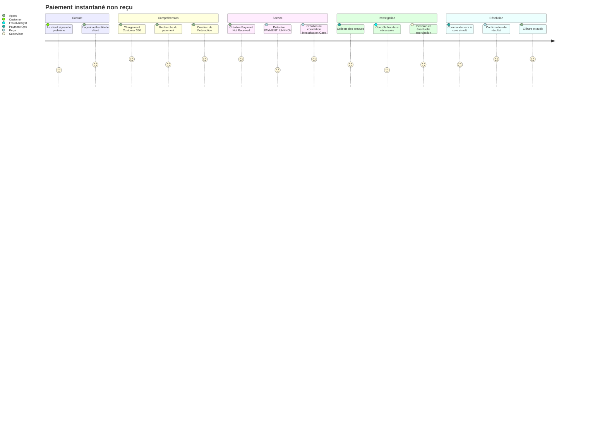

# I1 — Customer Journey : paiement instantané non reçu

## Objectif

Définir le parcours métier de référence du portfolio **MayaBank Pega Solution Architecture**. Ce document décrit le besoin métier indépendamment du runtime. Les écrans, règles et composants Pega seront implémentés lors des itérations suivantes.

## Scénario fil rouge

Un client MayaBank indique qu'un paiement instantané / Wero simulé a été débité mais que le bénéficiaire ne l'a pas reçu. Le statut du système de paiement est `UNKNOWN`. Un agent Customer Service doit retrouver le client, comprendre l'interaction, ouvrir ou rejoindre un dossier d'investigation, obtenir les éléments de preuve, faire appliquer les règles de décision et conduire le dossier jusqu'à une résolution auditable.

## Personas

| Persona | Responsabilité | Droits fonctionnels attendus |
|---|---|---|
| Customer | Signale le problème et fournit les informations nécessaires | Consulter ses demandes et répondre aux sollicitations |
| Customer Service Agent | Identifie le client, consulte la vue 360, crée la demande de service | Lire Customer 360, créer/mettre à jour interaction et service request |
| Payment Ops | Analyse le paiement et la réconciliation | Traiter les investigations paiement |
| Fraud Analyst | Analyse les suspicions de fraude | Lire les éléments utiles et rendre un avis fraude |
| Supervisor | Gère escalades, SLA et exceptions | Réaffecter, approuver certaines résolutions, piloter le backlog |
| Auditor | Contrôle a posteriori | Lecture seule des dossiers, décisions et traces d'audit |
| SRE / Support | Diagnostique les incidents techniques | Accès technique sans droit de décision métier |

## Canaux simulés

- Call center / agent desktop ;
- chat ;
- web self-service ;
- mobile self-service.

Le POC n'a pas besoin d'implémenter quatre frontaux. Ils représentent quatre origines d'interaction qui convergent vers le même modèle de service.

## Parcours cible

## Étapes détaillées

### J1 — Identifier et authentifier le client

Entrées : identifiant client synthétique, facteur d'authentification simulé, canal.

Sorties : `customerId`, niveau d'authentification, contexte d'interaction.

Règle : aucune donnée bancaire détaillée n'est affichée avant authentification suffisante.

### J2 — Construire la vue Customer 360

La vue agrège les références nécessaires sans déplacer l'autorité métier vers Pega : identité, comptes, cartes, contrats, paiements récents, interactions et dossiers ouverts.

### J3 — Enregistrer l'interaction

Créer `CustomerInteraction` avec : `interactionId`, `channel`, `customerId`, `startedAt`, `agentId`, `reason`, `summary`, `linkedCaseIds`, `consentContext`.

### J4 — Créer la Service Request

Type : `PAYMENT_NOT_RECEIVED`.

Données minimales : `paymentId`, montant, devise, date/heure, bénéficiaire masqué, canal, motif, criticité, éléments fournis par le client.

### J5 — Triage

Le triage lit le statut du Payment Core simulé :

- `COMPLETED` : expliquer/approfondir selon éléments de réconciliation ;
- `REJECTED` : fournir le motif et orienter vers une demande adaptée ;
- `UNKNOWN` : créer ou corréler un `PAYMENT_UNKNOWN` ;
- suspicion fraude : créer/référencer `FRAUD_REVIEW` ;
- doublon : créer/référencer `DUPLICATE_PAYMENT`.

### J6 — Investigation

Payment Ops analyse transaction, événements, réponse du core, éléments de réconciliation et traces techniques utiles. Les données techniques sont corrélées par `correlationId` mais ne remplacent pas la preuve métier.

### J7 — Décision et approbation

Les règles déterministes produisent une décision et des reason codes. Une approbation humaine est obligatoire pour toute action sensible définie par politique.

### J8 — Résolution

Pega orchestre la demande ; le **Payment Core simulé reste le système qui exécute l'action financière**. Le résultat est renvoyé sous forme de réponse ou d'événement corrélé.

### J9 — Clôture

Le Service Case et l'Investigation Case sont clôturés uniquement si les critères de clôture sont satisfaits. L'interaction conserve les références nécessaires à l'audit selon les règles de rétention.

## Résultats métier attendus

- résolution au premier contact lorsque l'information disponible suffit ;
- réduction du temps d'investigation ;
- aucune action financière irréversible hors système de record ;
- traçabilité complète des décisions et approbations ;
- séparation claire des erreurs métier, techniques et états inconnus.

## KPI du POC

| KPI | Définition |
|---|---|
| FCR | % de demandes résolues sans réouverture ni transfert différé |
| Average Case Age | âge moyen des dossiers ouverts |
| SLA Breach Rate | % de dossiers dépassant le SLA cible |
| Reopen Rate | % de dossiers réouverts après résolution |
| Escalation Rate | % de dossiers escaladés vers Supervisor |
| Manual Review Rate | % nécessitant une décision humaine |
| Resolution Lead Time | durée création -> résolution |

## Critères d'acceptation I1

- le parcours relie explicitement Customer -> Interaction -> Service Request -> Investigation Case ;
- Pega est orchestrateur et non ledger ;
- les personas et responsabilités sont explicites ;
- les canaux convergent vers le même modèle ;
- le traitement `UNKNOWN`, fraude, doublon, timeout et réconciliation est prévu ;
- SLA, audit, décision et approbation sont présents ;
- aucune capacité Customer Service/CDH n'est déclarée exécutée à ce stade.

**Statut : DESIGNED — I1. Runtime validation : non applicable à I1.**