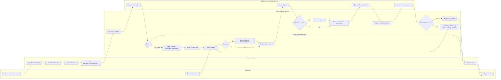

# I1 — Process Model / BPMN-like flow

## Portée

Ce diagramme représente le processus métier de référence. Il est volontairement versionnable en Markdown/Mermaid. Une exportation BPMN 2.0 native pourra être ajoutée quand l'outil de modélisation choisi sera utilisé.

## Événements de début

- interaction client ;
- événement `PaymentUnknownDetected` ;
- détection de divergence de réconciliation ;
- remontée de risque fraude.

## Événements intermédiaires

- réponse Payment Read ;
- evidence reçue ;
- approbation terminée ;
- callback/outcome ;
- timer SLA ;
- timeout technique.

## Événements de fin

- demande expliquée sans investigation ;
- investigation résolue et confirmée ;
- dossier annulé avec motif ;
- dossier dupliqué et rattaché au Case canonique.

## Règles de modélisation

- un timeout n'est pas un résultat financier ;
- un appel synchrone est réservé aux lectures/commandes ayant besoin d'une réponse immédiate ;
- l'attente longue doit être modélisée comme état de Case, pas comme thread bloqué ;
- les décisions sensibles sont explicites et auditables ;
- la fermeture exige un outcome déterministe ou une justification métier documentée.

**Statut : DESIGNED — I1.**