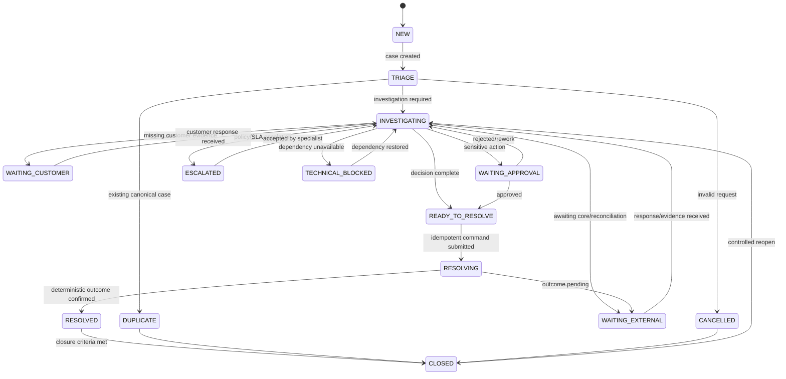

# I1 — State Machine canonique

## PAYMENT_UNKNOWN



## Invariants

1. `UNKNOWN` n'est jamais transformé en `SUCCESS` ou `FAILED` par supposition.
2. Une transition vers `RESOLVING` exige une décision explicite et, lorsqu'elle est requise, une approbation humaine.
3. Une commande vers le core possède un identifiant d'idempotence stable.
4. `RESOLVED` signifie que le résultat externe est déterministe ; `CLOSED` ajoute les critères d'audit et de fin de traitement.
5. `TECHNICAL_BLOCKED` ne transfère pas la décision métier au support technique.
6. Une réouverture crée une nouvelle séquence d'audit sans effacer la précédente.

## Événements métier associés

| Transition | Événement logique |
|---|---|
| création | `PaymentInvestigationCreated` |
| entrée investigation | `InvestigationStarted` |
| attente externe | `ExternalEvidenceRequested` |
| approbation | `ApprovalRequested` / `ApprovalCompleted` |
| résolution demandée | `ResolutionRequested` |
| résultat reçu | `ResolutionCompleted` |
| escalade | `CaseEscalated` |
| clôture | `CaseClosed` |
| réouverture | `CaseReopened` |

Les contrats AsyncAPI seront versionnés lors de I6. I1 fixe seulement la sémantique métier.

## Gestion des timeouts

Un timeout technique ne vaut pas échec métier. Après timeout :

```text
request sent
 -> timeout
 -> state = WAITING_EXTERNAL or TECHNICAL_BLOCKED
 -> reconcile/query status
 -> only then determine business outcome
```

## Doublons

La détection s'appuie sur une clé métier/corrélation définie par le scénario. Si un Case canonique existe :

```text
new request
 -> detect existing active/canonical case
 -> mark new case/request DUPLICATE when applicable
 -> link canonicalCaseId
 -> preserve audit
```

## Réouverture contrôlée

```text
CLOSED
 -> new material evidence / late callback / confirmed error
 -> reopenReason required
 -> previous resolution retained
 -> INVESTIGATING
```

**Statut : DESIGNED — I1.**